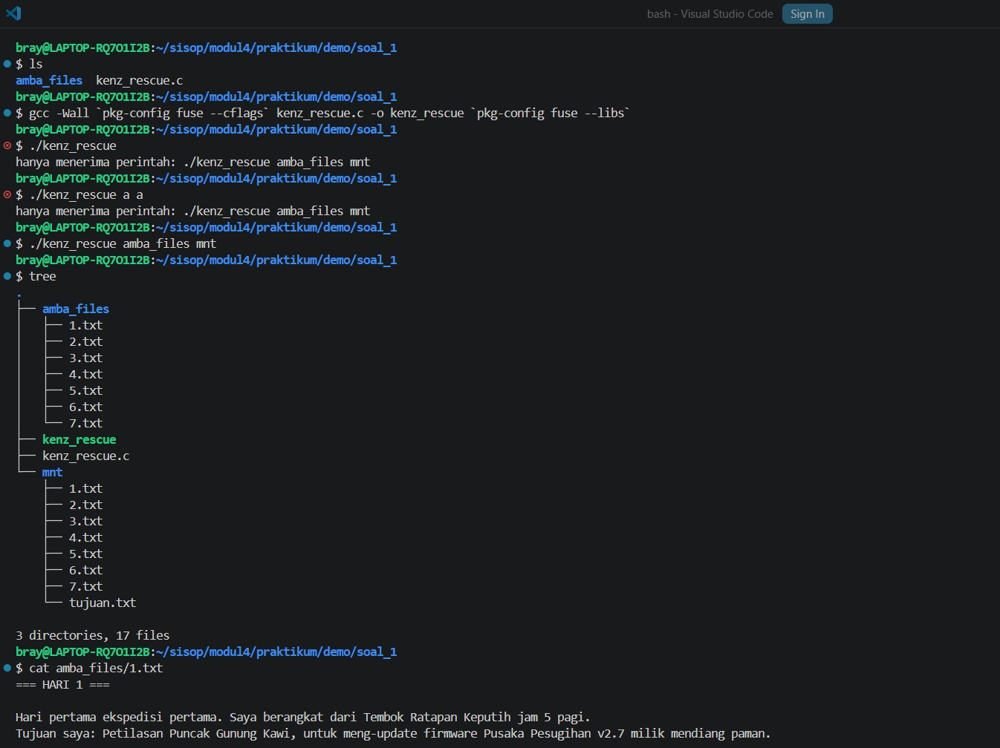
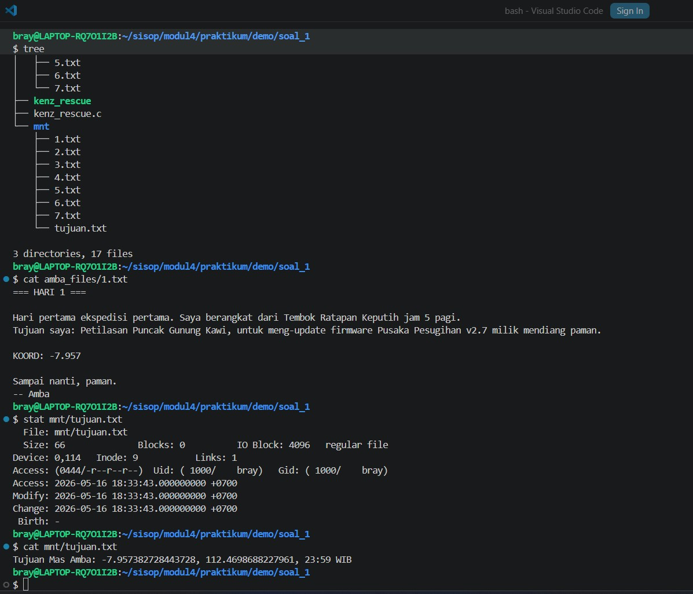
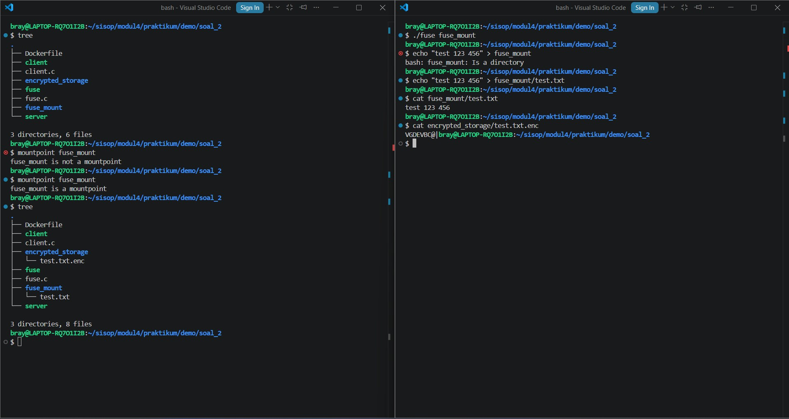
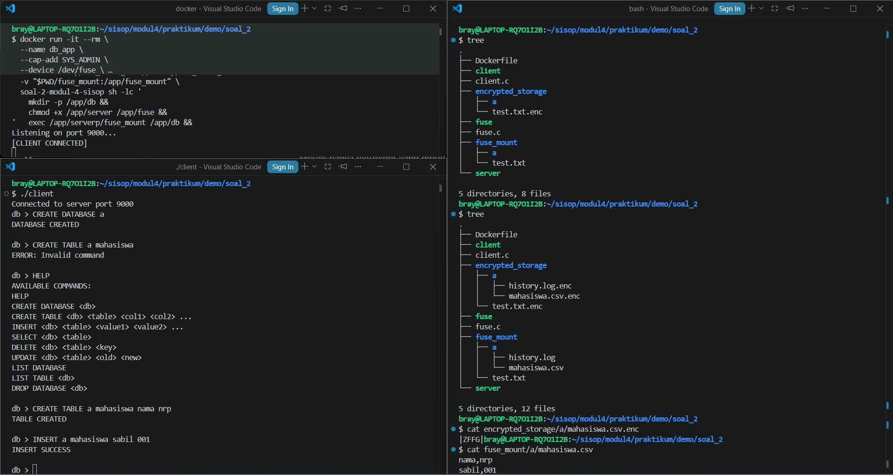

# SISOP-4-2026-IT-041

| Nama                   | NRP        |
| ---------------------- | ---------- |
| Muhamad Sabilil Haq    | 5027251041 |

<details>
<summary>Daftar Isi</summary>

- [Soal 1: Save Asisten Kenz](#soal-1---save-asisten-kenz)
  - [Penjelasan Umum](#penjelasan-umum)
  - [File `kenz_rescue.c`](#file-kenz_rescuec)
  - [Dokumentasi](#dokumentasi)
- [Soal 2: Poke MOO](#soal-2---poke-moo)
  - [Penjelasan Umum](#penjelasan-umum-1)
  - [File `fuse.c`](#file-fusec)
  - [File `Dockerfile`](#file-dockerfile)
  - [File `client.c`](#file-clientc)
  - [Dokumentasi](#dokumentasi-1)

</details>

# Soal 1 - Save Asisten Kenz

## Penjelasan Umum

Pada soal ini, download terlebih dahulu file zip (`amva_files.zip`) yang telah disediakan. Setelah mendownloadnya, ekstrak filenya, hapus file zipnya. Kemudian, diminta untuk membuat program **FUSE** dalam bahasa C bernama `kenz_rescue.c` yang bekerja sebagai filesystem cermin (*passthrough*) dari folder `amba_files/` ke directory mount `mnt/`. File asli di source tidak boleh berubah, tetapi di sisi mount harus muncul satu file virtual tambahan bernama `tujuan.txt`.

File virtual tersebut tidak disimpan secara fisik di disk, melainkan dibangkitkan secara *on-the-fly* ketika dibaca. Isi file virtual diperoleh dengan menggabungkan fragmen koordinat yang terdapat pada file `1.txt` sampai `7.txt`.

Secara umum sistem ini memiliki dua bagian utama:

- **Passthrough Filesystem**
  - Seluruh file asli dari `amba_files/` diteruskan langsung ke mount directory
  - Operasi dasar seperti `getattr`, `readdir`, `open`, dan `read` diteruskan ke source asli

- **Virtual File**
  - Menambahkan file virtual `tujuan.txt`
  - Isi file dibentuk secara dinamis dari fragmen `KOORD:`
  - File ini hanya muncul di mount directory dan tidak ada di source asli

---

## File `kenz_rescue.c`

File ini terbagi menjadi beberapa bagian, yaitu sebagai berikut.

### 1. Header / library yang digunakan

Bagian pertama berisi header yang diperlukan untuk menjalankan program FUSE, membaca direktori, membuka file, memproses path, serta menangani informasi waktu dan tipe data sistem.

```
#define _GNU_SOURCE
#define FUSE_USE_VERSION 28
#include <fuse.h>
#include <errno.h>
#include <fcntl.h>
#include <dirent.h>
#include <stdio.h>
#include <stdlib.h>
#include <string.h>
#include <sys/stat.h>
#include <sys/types.h>
#include <unistd.h>
#include <limits.h>
#include <stdint.h>
#include <time.h>
```

---

### 2. Variabel Global

Variabel ini digunakan agar seluruh callback `FUSE` dapat mengetahui lokasi asli dari source filesystem.

```
static char *g_source_root = NULL;
```
---

### 3. Build Source Path
Fungsi berikut digunakan untuk membentuk path asli menuju source file.
```
static void build_source_path(char *dst, size_t dstsz, const char *path)
{
    if (strcmp(path, "/") == 0) {
        snprintf(dst, dstsz, "%s", g_source_root);
    } else {
        snprintf(dst, dstsz, "%s%s", g_source_root, path);
    }
}
```
---

### 4. Fungsi `is_virtual_tujuan`

Fungsi berikut digunakan untuk mengecek apakah file yang sedang diakses adalah file virtual `tujuan.txt`.

```
static int is_virtual_tujuan(const char *path)
{
    return strcmp(path, "/tujuan.txt") == 0;
}
```

---

### 5. Fungsi `append_buf`

Program menggunakan buffer dinamis untuk menyusun isi file virtual karena isi `tujuan.txt` dibangun dari banyak file, ukuran akhirnya tidak diketahui di awal sehingga dibutuhkan buffer dinamis.
```
static void append_buf(char **buf, size_t *len, size_t *cap, const char *data, size_t data_len)
{
    if (*len + data_len + 1 > *cap) {
        size_t new_cap = *cap ? *cap : 128;
        while (*len + data_len + 1 > new_cap) {
            new_cap *= 2;
        }
        char *tmp = realloc(*buf, new_cap);
        if (!tmp) {
            free(*buf);
            *buf = NULL;
            *len = *cap = 0;
            return;
        }
        *buf = tmp;
        *cap = new_cap;
    }
    memcpy(*buf + *len, data, data_len);
    *len += data_len;
    (*buf)[*len] = '\0';
}
```

---

### 6. Fungsi `build_tujuan_content`

Fungsi ini digunakan untuk membuat isi file virtual `tujuan.txt` secara *on-the-fly* dengan menggabungkan fragmen `KOORD:` dari file `1.txt` sampai `7.txt`.

```
static char *build_tujuan_content(size_t *out_len)
{
    const char *prefix = "Tujuan Mas Amba: ";
    char *out = NULL;
    size_t len = 0, cap = 0;

    append_buf(&out, &len, &cap, prefix, strlen(prefix));
    if (!out) return NULL;

    for (int i = 1; i <= 7; i++) {
        char file_path[PATH_MAX];
        snprintf(file_path, sizeof(file_path), "%s/%d.txt", g_source_root, i);

        FILE *fp = fopen(file_path, "r");
        if (!fp) continue;

        char *line = NULL;
        size_t line_cap = 0;
        ssize_t nread;
        while ((nread = getline(&line, &line_cap, fp)) != -1) {
            char *p = strstr(line, "KOORD:");
            if (!p) continue;
            p += strlen("KOORD:");
            while (*p == ' ' || *p == '\t') p++;
            char *end = p + strcspn(p, "\r\n");
            append_buf(&out, &len, &cap, p, (size_t)(end - p));
            break;
        }
        free(line);
        fclose(fp);
    }

    append_buf(&out, &len, &cap, "\n", 1);
    if (out_len) *out_len = len;
    return out;
}
```
Fungsi ini membaca file `1.txt` sampai `7.txt`, mengambil bagian `KOORD:`, lalu menggabungkannya menjadi isi file virtual `tujuan.txt`.

---

### 7. Callback `getattr`

Fungsi ini digunakan untuk mengambil informasi metadata file seperti ukuran file, permission, dan tipe file.

```
static int kenz_getattr(const char *path, struct stat *stbuf)
{
    memset(stbuf, 0, sizeof(struct stat));

    if (is_virtual_tujuan(path)) {
        size_t len = 0;
        char *content = build_tujuan_content(&len);
        if (!content) return -ENOMEM;
        free(content);

        stbuf->st_mode = S_IFREG | 0444;
        stbuf->st_nlink = 1;
        stbuf->st_size = (off_t)len;
        stbuf->st_uid = getuid();
        stbuf->st_gid = getgid();
        stbuf->st_mtime = time(NULL);
        stbuf->st_atime = stbuf->st_mtime;
        stbuf->st_ctime = stbuf->st_mtime;
        return 0;
    }

    char fpath[PATH_MAX];
    build_source_path(fpath, sizeof(fpath), path);

    if (lstat(fpath, stbuf) == -1)
        return -errno;

    return 0;
}
```

---

### 8. Callback `readdir`

Fungsi ini digunakan untuk membaca isi directory pada mount filesystem.

```
static int kenz_readdir(const char *path, void *buf,
                        fuse_fill_dir_t filler,
                        off_t offset,
                        struct fuse_file_info *fi)
{
    (void) offset;
    (void) fi;

    char fpath[PATH_MAX];
    build_source_path(fpath, sizeof(fpath), path);

    DIR *dp = opendir(fpath);
    if (!dp) return -errno;

    if (filler(buf, ".", NULL, 0)) {
        closedir(dp);
        return 0;
    }

    if (filler(buf, "..", NULL, 0)) {
        closedir(dp);
        return 0;
    }

    struct dirent *de;

    while ((de = readdir(dp)) != NULL) {
        struct stat st;
        memset(&st, 0, sizeof(st));

        st.st_ino = de->d_ino;
        st.st_mode = de->d_type << 12;

        if (filler(buf, de->d_name, &st, 0))
            break;
    }

    closedir(dp);

    if (strcmp(path, "/") == 0) {
        struct stat st;
        memset(&st, 0, sizeof(st));

        st.st_mode = S_IFREG | 0444;
        st.st_nlink = 1;

        filler(buf, "tujuan.txt", &st, 0);
    }

    return 0;
}
```

---

### 9. Callback `open`

Fungsi ini digunakan untuk membuka file yang diakses user.

```
static int kenz_open(const char *path,
                     struct fuse_file_info *fi)
{
    if (is_virtual_tujuan(path)) {
        fi->fh = 0;
        return 0;
    }

    char fpath[PATH_MAX];
    build_source_path(fpath, sizeof(fpath), path);

    int fd = open(fpath, O_RDONLY);

    if (fd == -1)
        return -errno;

    fi->fh = (uint64_t)fd;
    return 0;
}
```

---

### 10. Callback `read`

Fungsi ini digunakan untuk membaca isi file.

```
static int kenz_read(const char *path,
                     char *buf,
                     size_t size,
                     off_t offset,
                     struct fuse_file_info *fi)
{
    if (is_virtual_tujuan(path)) {
        size_t content_len = 0;
        char *content = build_tujuan_content(&content_len);

        if (!content)
            return -ENOMEM;

        if ((size_t)offset < content_len) {
            if (offset + (off_t)size > (off_t)content_len) {
                size = content_len - (size_t)offset;
            }

            memcpy(buf, content + offset, size);
        } else {
            size = 0;
        }

        free(content);
        return (int)size;
    }

    int fd = (int)fi->fh;

    ssize_t res = pread(fd, buf, size, offset);

    if (res == -1)
        return -errno;

    return (int)res;
}
```

---

### 11. Callback `release`

Fungsi ini digunakan untuk menutup file descriptor setelah file selesai digunakan.

```
static int kenz_release(const char *path,
                        struct fuse_file_info *fi)
{
    (void)path;

    if (!is_virtual_tujuan(path) && fi->fh > 0) {
        close((int)fi->fh);
    }

    return 0;
}
```

---

### 12. Callback `access`

Fungsi ini digunakan untuk mengecek hak akses file.

```
static int kenz_access(const char *path, int mask)
{
    if (is_virtual_tujuan(path))
        return 0;

    char fpath[PATH_MAX];
    build_source_path(fpath, sizeof(fpath), path);

    if (access(fpath, mask) == -1)
        return -errno;

    return 0;
}
```

---

### 13. Fungsi `setup_environment`

Fungsi ini digunakan untuk melakukan pengecekan awal sebelum filesystem dijalankan.

```
static int setup_environment(void)
{
    struct stat st;

    if (stat("mnt/tujuan.txt", &st) == 0) {
        fprintf(stderr, "command sudah dijalankan\n");
        return -1;
    }

    if (stat("amba_files", &st) != 0) {
        fprintf(stderr, "folder amba_files tidak ditemukan\n");
        return -1;
    }

    mkdir("mnt", 0755);

    return 0;
}
```
Fungsi ini memastikan source tersedia dan membuat mount directory jika belum ada.

---

### 14. Struktur Operasi FUSE

Seluruh callback FUSE didaftarkan pada struktur berikut.

```
static struct fuse_operations kenz_oper = {
    .getattr = kenz_getattr,
    .readdir = kenz_readdir,
    .open = kenz_open,
    .read = kenz_read,
    .release = kenz_release,
    .access = kenz_access,
};
```

---

### 15. Fungsi `main`

Fungsi `main()` merupakan entry point utama program.

```
int main(int argc, char *argv[])
{
    if (
        argc != 3 ||
        strcmp(argv[1], "amba_files") != 0 ||
        strcmp(argv[2], "mnt") != 0
    ) {
        fprintf(stderr,
            "hanya menerima perintah: ./kenz_rescue amba_files mnt\n");
        return 1;
    }

    if (setup_environment() != 0) {
        return 1;
    }

    g_source_root = realpath(argv[1], NULL);

    if (!g_source_root) {
        perror("realpath");
        return 1;
    }

    int fuse_argc = argc - 1;

    char **fuse_argv = calloc((size_t)fuse_argc + 1,
                              sizeof(char *));

    if (!fuse_argv) {
        perror("calloc");
        free(g_source_root);
        return 1;
    }

    fuse_argv[0] = argv[0];
    fuse_argv[1] = argv[2];

    for (int i = 3; i < argc; i++) {
        fuse_argv[i - 1] = argv[i];
    }

    int ret = fuse_main(fuse_argc,
                        fuse_argv,
                        &kenz_oper,
                        NULL);

    free(fuse_argv);
    free(g_source_root);

    return ret;
}
```
Fungsi ini melakukan validasi argumen, setup environment, menyimpan source root, lalu menjalankan filesystem menggunakan `fuse_main()`.

---

## Dokumentasi






# Soal 2 - Poke MOO

## Penjelasan Umum

Pada soal ini, dibuat sebuah mini database service dengan konsep bahwa folder merepresentasikan database dan file CSV merepresentasikan tabel. Program dijalankan melalui TCP connection port 9000, sedangkan lapisan penyimpanan file diatur menggunakan FUSE agar direktori yang dilihat user melalui `fuse_mount` menjadi translator dari data yang benar-benar tersimpan di `encrypted_storage`. Selain itu, seluruh file yang dibuat melalui `fuse_mount` akan disimpan dalam bentuk terenkripsi menggunakan algoritma XOR dengan key `0x76` dan diberi ekstensi `.enc`. Arsitektur ini sesuai dengan deskripsi soal yang meminta koneksi TCP, FUSE translator, serta containerization dengan Docker.

---

## File `fuse.c`

File `fuse.c` merupakan inti dari sistem filesystem terenkripsi. File ini bertugas menghubungkan dua direktori, yaitu:

- `fuse_mount` sebagai mount point yang dilihat user.
- `encrypted_storage` sebagai penyimpanan asli file yang sudah terenkripsi.

### 1. Library dan Variabel Global

Di bagian awal, file ini menggunakan library utama FUSE dan beberapa library standar C untuk operasi file, direktori, string, dan waktu.

```
#define FUSE_USE_VERSION 28
#include <fuse.h>
#include <stdio.h>
#include <string.h>
#include <errno.h>
#include <fcntl.h>
#include <dirent.h>
#include <unistd.h>
#include <stdlib.h>
#include <sys/stat.h>
#include <sys/time.h>
#define XOR_KEY 0x76
char STORAGE_DIR[1024];
```

---

### 2.Fungsi Enkripsi XOR

Fungsi berikut digunakan untuk mengenkripsi maupun mendekripsi isi file.

```
static void xor_buffer(char *buf, size_t size)
{
    for (size_t i = 0; i < size; i++)
        buf[i] ^= XOR_KEY;
}
```

---

### 3. Pengolahan Path

File ini memiliki dua fungsi path utama:
- `fullpath()`: Fungsi ini menyusun path mentah ke dalam encrypted_storage tanpa modifikasi tambahan.
- `encpath()`: Fungsi ini menentukan path file terenkripsi. Jika yang diakses adalah file, maka nama file akan ditambahkan ekstensi `.enc`. Jika path yang diakses adalah direktori, maka direktori tetap dipakai apa adanya.

```
static void fullpath(char fpath[1024], const char *path)
static void encpath(char fpath[1024], const char *path)
```

---

### 4. Implementasi Operasi FUSE

File ini mengimplementasikan operasi FUSE yang diminta pada soal
- `xmp_getattr()`: Digunakan untuk membaca metadata file atau folder.
- `xmp_readdir()`: Digunakan untuk menampilkan isi direktori. Pada bagian ini, nama file .enc akan ditampilkan tanpa ekstensi .enc agar user melihat nama file aslinya.
- `xmp_mkdir()` dan `xmp_rmdir()`: Digunakan untuk membuat dan menghapus direktori.
- `xmp_create()`: Digunakan untuk membuat file baru. File yang dibuat langsung disimpan dalam bentuk terenkripsi.
- `xmp_open()`: Membuka file yang diminta oleh user.
- `xmp_read()`: Membaca isi file terenkripsi lalu mendekripsinya sebelum dikirim ke user.
- `xmp_write()`: Menulis data ke file dengan cara mengenkripsi buffer terlebih dahulu.
- `xmp_truncate()`: Mengubah ukuran file.
- `xmp_unlink()`: Menghapus file.
- `xmp_utimens()`: Mengubah timestamp file.

---

### 5. Fungsi `main()`

Bagian `main()` bertugas menentukan lokasi `encrypted_storage` secara dinamis dengan `getcwd()`:
```
getcwd(cwd, sizeof(cwd));
snprintf(STORAGE_DIR, sizeof(STORAGE_DIR), "%s/encrypted_storage", cwd);
```
Setelah itu, filesystem dijalankan melalui:
```
return fuse_main(argc, argv, &xmp_oper, NULL);
```

---

## File `Dockerfile`

File `Dockerfile` digunakan untuk membuat image aplikasi berbasis `ubuntu:latest`, lalu menyiapkan environment agar server dapat dijalankan di dalam container. Struktur ini sesuai dengan instruksi soal yang meminta image aplikasi dibuat pada `/app` dan membuka port `9000`
```
FROM ubuntu:latest

RUN apt update && apt install -y \
    fuse \
    libfuse-dev \
    gcc \
    make

WORKDIR /app

COPY . /app

RUN chmod +x server
RUN mkdir -p /app/db

EXPOSE 9000

CMD ["./server"]
```
Agar imagenya dinamakan `soal-2-modul-4-sisop`, buildnya menggunakan command:
```
docker build -t soal-2-modul-4-sisop .
```
Dan untuk run containernya sendiri mengguunakan command:
```
docker run -it --rm \
  --name db_app \
  --cap-add SYS_ADMIN \
  --device /dev/fuse \
  --security-opt apparmor=unconfined \
  -p 9000:9000 \
  -v "$PWD/server:/app/server" \
  -v "$PWD/fuse:/app/fuse" \
  -v "$PWD/encrypted_storage:/app/encrypted_storage" \
  -v "$PWD/fuse_mount:/app/fuse_mount" \
  soal-2-modul-4-sisop sh -lc '
    mkdir -p /app/db &&
    chmod +x /app/server /app/fuse &&
    /app/fuse /app/fuse_mount -f &
    sleep 1 &&
    mount --bind /app/fuse_mount /app/db &&
    exec /app/server
'
```

## File `client.c`

File `client.`c adalah program client berbasis TCP yang digunakan untuk berinteraksi dengan server pada port `9000`. File ini hanya bertugas sebagai perantara input user ke server dan menampilkan response dari server. Implementasinya sesuai dengan bagian soal yang meminta client untuk berkomunikasi dengan server melalui socket TCP.

### 1. Inisialisasi Socket

Program membuat socket TCP menggunakan:
```
socket(AF_INET, SOCK_STREAM, 0);
```
Lalu mengatur alamat server ke:
```
127.0.0.1:9000
```

---

### 2.Koneksi ke Server
Client melakukan koneksi ke server dengan:
```
connect(sock, (struct sockaddr *)&server_addr, sizeof(server_addr))
```
Jika koneksi berhasil, client menampilkan pesan: ``Connected to server port 9000``

---

### 3. Loop

Di dalam loop utama:

- client menampilkan prompt `db >`
- user mengetik command
- input dikirim ke server dengan `send()`
- client menerima jawaban server dengan `recv()`
- hasilnya ditampilkan ke terminal

Jika user mengetik `EXIT`, program akan berhenti.

---

## Dokumentasi






